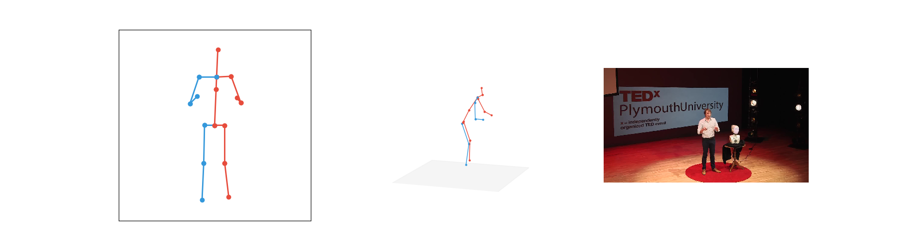
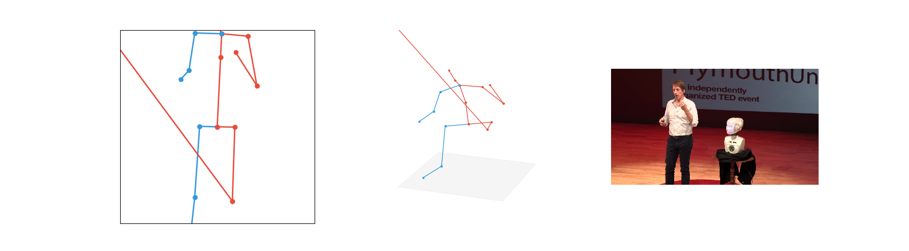

## Cases where 3D-pose-baseline falls short

The model is trained on a dataset with relatively limited variation:

- Recorded in a studio
- Cameras at a few specific angles
- A few different models

For some scenes, the 3D skeleton seems to be leaning forward where it shouldn't.
My 2D predictions are from OpenPose, which don't have the same skeletal structure. In
particular, these points are missing:

- Hip (there are left and right hip points, though)
- Head (as in somewhere at the top of the head)
- Spine (somewhere chest-level)

So I have to fill these in myself and play around a bit with what would be a good
heuristic. I couldn't prevent this leaning effect though; I tried making the head higher
and moved the spine point higher and lower.

When a point is missing, predictions go everywhere. The best solution here is probably to
fill in the previous value here.

